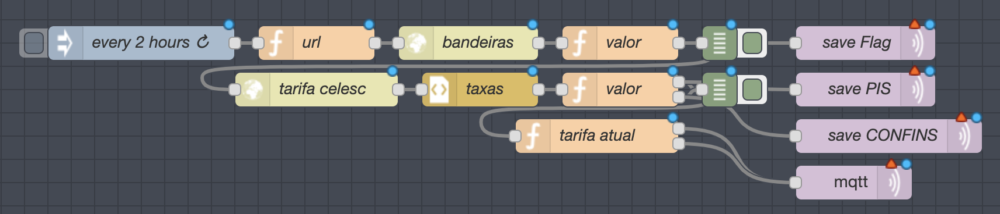

# celesc-node-red-HA
Get the current energy price for CELESC

## How it works

The formula to get the current price for a kWh is:
```
(baseRate+flagRate)/((100-(pis+confins+icms))/100)
```
let's break that up:
- `baseRate` is a fixed value for your home that only changes in August. Mine is `R$0.46978`. You can check yours [HERE](https://www.celesc.com.br/tarifas-de-energia#tarifas-vigentes). You will need to enter this value manually
- `flagRate` is the rate of the current Flag. That changes every month. You can read more [HERE](http://www.aneel.gov.br/bandeiras-tarifarias)
- `pis` and `confins` are tributes that change every month
- `icms` is fixed at 12% for the first 150kWh and 25% for any consumption after that

## Node-RED

For getting the values that change every month, we need to craw CELESC's page.
I'm doing that on a Node-RED flow.

### What you need

Before importing the flow, you need to add this to your Node-RED add-on configuration:
```json
"npm_packages": [
    "xmldom",
    "moment"
  ]
```
If you are using a stand-alone Node-RED installation just use
```shell
npm install xmldom moment
```

After that you need to enable the `require` package in Node-RED. To do it just open your `node-red/settings.js` and add `require:require` to `functionGlobalContext`, like so:
```javascript
functionGlobalContext: {
    require:require,
},
```

That will allow to use `require` inside a Function node to get `xmldom` and `moment`.

After that just need to import [THIS FLOW](flow.json) on Node-RED and change your broker settings.
On Node-RED, use the menu on the top right of the screen, then `Import` > `Clipboard` and paste it.



#### This flow uses:
- [API do Setor Elétrico](https://apidosetoreletrico.com.br/api-docs/index.html) to get the current `flag` value.
- Crawling [CELESC's website](https://www.celesc.com.br/tarifas-de-energia#tributos) to get `pis` and `confins`. Keep in mind that if the website changes, this can break
- Hardcoded `base` tariff value on the `tarifa atual` node. Please change it to match your value.

## Home Assistant

You need to create two MQTT sensors, one for the first `<150 kWh` rate, and another for the `>150 kWh` rate

```yaml
sensor:
  - platform: mqtt
    state_topic: "home/power/cost1"
    name: "Power Cost less 150kWh"
    unit_of_measurement: "R$"
  - platform: mqtt
    state_topic: "home/power/cost2"
    name: "Power Cost more 150kWh"
    unit_of_measurement: "R$"
```

Assuming that you have a energy sensor called `sensor.power_meter_energy_total`, this two template sensors track the current power rate and the total cost.

```yaml
##### COST #####
# if (energy < 150kWh) cost = energy * rate1
# if (energy > 150kWh) cost = (150 * rate1) + (energy - 150) * rate2
sensor:
  - platform: template
    sensors:
      power_rate:
        friendly_name: "Power Rate"
        unit_of_measurement: 'R$'
        value_template: >
          
          
            {{states('sensor.power_cost_less_150kwh')|float if energy < 150 else states('sensor.power_cost_more_150kwh')|float}}
          
            {{ states('sensor.power_rate') }}
          
      total_power_cost:
        friendly_name: "Power Cost"
        unit_of_measurement: 'R$'
        value_template: >
          
          
            
                {{'%.2f'|format(energy * states('sensor.power_cost_less_150kwh')|float)}}
              
                {{'%.2f'|format((150 * states('sensor.power_cost_less_150kwh')|float) + (energy - 150 * states('sensor.power_cost_more_150kwh')|float))}}
              
          
            {{ states('sensor.total_power_cost') }}
          
```

## Extras

If you want to keep track of all values needed to calculate the power rate, add these sensors too:
```yaml
##### CELESC ######
sensor:
  - platform: mqtt
    name: Power Tax PIS
    unit_of_measurement: '%'
    state_topic: "home/power/pis"
  - platform: mqtt
    name: Power Tax CONFINS
    unit_of_measurement: '%'
    state_topic: "home/power/confins"
  - platform: mqtt
    name: Power Flag Value
    unit_of_measurement: 'R$'
    state_topic: "home/power/flag"
```

### Reseting the power meter

If you also want to automate reseting the total energy meter, check out [THIS TUTORIAL](ResetingEnergyTotal.md)
