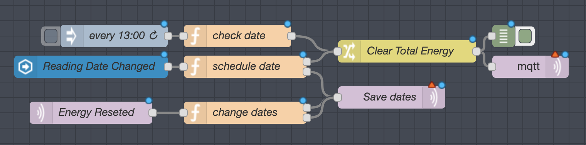

# Reseting the power meter

I'm using [Tasmota](https://github.com/arendst/Sonoff-Tasmota) with a PZEM sensor to measure the total energy in my house.

It outputs the total energy to a sensor `sensor.power_meter_energy_total`, which needs to be reseted to `0` when CELESC reads the power meter, in order to calculate the monthly energy cost.

To do that I'm using [Douglas' CELESC custom component](https://github.com/dougbaptista/custom_components) to get the date of the next reading from CELESC's website.
Add the component and configuration to your Home Assistant following his instructions, like so:

```yaml
sensor:
  - platform: celesc
    name: Next Power Reading
    cpf: !secret cpf
    senha: !secret celesc_password
    unidade_consumidora: !secret consumer_unit
```

That will generate a sensor called `sensor.next_power_reading`.
Then a Node-RED automation will check the date of the last reset, and the current date against the next reading date and send a command to `Tasmota` to reset the total energy counter.

## Requirements
This automation needs a few sensors on Home Assistant. Add these to your configuration:

```yaml
- platform: mqtt
  name: Last Reading Date
  state_topic: "home/power/reseted_at"
- platform: mqtt
  name: Scheduled Energy Reset
  state_topic: "home/power/will_reset_at"
```

Also it needs all the Requirements from the other flow. Make sure you flowed that [HERE](README.md).

## Node-RED Flow



Just import [THIS](reset_energy_flow.json) json to your flow.

Then you will need to change your MQTT Broker configuration on the MQTT nodes.
The `Clear Total Energy` node sets the topic of the energy sensor that needs to be cleared. For me that's `powermeter/cmnd/EnergyReset3`, but change accordingly.

## Special thanks

- [Douglas Baptista](https://github.com/dougbaptista) for the awesome custom component!
